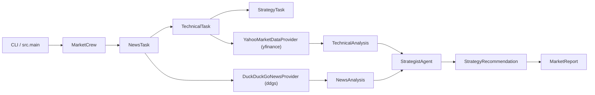

# market-ai-agents

A multi-agent market analysis MVP. Give it a ticker symbol and it produces a
`MarketReport` with a single recommendation — **`BUY`**, **`HOLD`**, or **`SELL`** —
backed by news sentiment and technical indicators.

> ⚠️ **Disclaimer.** This project generates analysis and signals only. It **never
> executes real orders, never connects to a broker, and is not financial advice.**
> It is an educational, open-source demonstration of multi-agent orchestration.

## Highlights

- **3 CrewAI agents** in a sequential pipeline: news → technical → strategist.
- **Deterministic core**: news search, market data, and all technical indicators
  (SMA/EMA/RSI/MACD/ATR/volatility/52-week range/volume ratio) are computed in
  pure Python — the LLM only interprets and decides.
- **DeepSeek** via its OpenAI-compatible API (model switchable between
  `deepseek-v4-flash` and `deepseek-v4-pro` through config).
- **Offline mock mode** (`--mock`) that runs the full pipeline with no API keys
  and no network.
- **Safe by design**: prompt-injection hardening, TTL news cache, explicit error
  hierarchy, and a `HOLD` + low-confidence fallback when anything fails.
- **Traceable reports**: every run is stamped with an `execution_id`, ticker,
  timestamp, model, and data-source timestamps.

## Architecture

```
┌──────────────┐    ┌──────────────────────────────────────────────┐
│   CLI / API  │───▶│                 MarketCrew                   │
│  src.main    │    │                                              │
└──────────────┘    │  NewsTask ──▶ TechnicalTask ──▶ StrategyTask│
                    │  (sequential, Process.sequential)           │
                    └───────┬──────────────────────────────┬──────┘
                            │                              │
              ┌─────────────▼─────────────┐   ┌────────────▼─────────────┐
              │   DuckDuckGoNewsProvider  │   │  YahooMarketDataProvider │
              │   (ddgs + TTLCache)       │   │  (yfinance)              │
              └─────────────┬─────────────┘   └────────────┬────────────┘
                            │                              │
                     NewsAnalysis                   MarketData / indicators
                            │                              │
                            └──────────┬───────────────────┘
                                       ▼
                            StrategistAgent (DeepSeek LLM)
                                       │
                                       ▼
                            StrategyRecommendation
                                       │
                                       ▼
                                  MarketReport
```



## Installation

Requires **Python 3.11+**.

```bash
git clone <your-repo-url>
cd <repo>
python -m venv .venv
# Windows:
.venv\Scripts\activate
# macOS / Linux:
source .venv/bin/activate

pip install -e ".[dev]"
```

## Configuration

Copy the example environment file and fill in your key (never commit real keys):

```bash
cp .env.example .env
```

| Variable | Default | Description |
| --- | --- | --- |
| `DEEPSEEK_API_KEY` | *(empty)* | DeepSeek API key. Required for real (non-mock) runs. |
| `DEEPSEEK_MODEL` | `deepseek-v4-flash` | Model to use (`deepseek-v4-flash` or `deepseek-v4-pro`). |
| `DEEPSEEK_BASE_URL` | `https://api.deepseek.com` | OpenAI-compatible base URL. |
| `NEWS_TTL_SECONDS` | `900` | News-search cache lifetime (seconds). |
| `REQUEST_TIMEOUT_SECONDS` | `30` | HTTP timeout (seconds). |

## Usage

### CLI

```bash
# Mock mode (offline, no keys, deterministic) — always works:
python -m src.main --ticker NVDA --mock

# Real analysis (requires DEEPSEEK_API_KEY + network):
python -m src.main --ticker NVDA

# Full report as JSON:
python -m src.main --ticker NVDA --mock --json

# Tune the inputs:
python -m src.main --ticker AAPL --period 6mo --interval 1d --news-limit 5 --json
```

Options: `--ticker` (required), `--period` (default `1y`), `--interval` (default
`1d`), `--news-limit` (default `10`), `--json`, `--mock`, `--help`.

### Python API

```python
from src.config.settings import Settings
from src.crew.market_crew import MarketCrew
from src.tools.market_data import YahooMarketDataProvider
from src.tools.news import DuckDuckGoNewsProvider

settings = Settings.from_env()
crew = MarketCrew(
    news_provider=DuckDuckGoNewsProvider(ttl_seconds=settings.news_ttl_seconds),
    market_data_provider=YahooMarketDataProvider(),
    settings=settings,
)
report = crew.run(ticker="NVDA", period="1y", interval="1d", news_limit=10)

print(report.recommendation.action)       # Action.BUY / HOLD / SELL
print(report.recommendation.confidence)   # float in [0, 1]
print(report.model_dump_json(indent=2))   # full serialized report
```

See [`examples/run_analysis.py`](examples/run_analysis.py) for a runnable example.

## Testing

```bash
# Unit tests (offline, mocked — no DeepSeek key needed):
pytest

# With coverage:
pytest --cov=src --cov-report=term-missing

# Integration tests (hit real DeepSeek/Yahoo/DuckDuckGo; auto-skip without a key):
pytest -m integration

# Linting:
ruff check .
```

## Agent architecture

| Agent | Role | Responsibility |
| --- | --- | --- |
| `MarketNewsAgent` | News analyst | Search recent news (ddgs) and classify sentiment. Never invents headlines. |
| `TechnicalAnalysisAgent` | Technical interpreter | Interprets indicators **already computed in Python**. Never recomputes or invents values. |
| `StrategistAgent` | Senior strategist | The only LLM decision step. Unifies news + technical inputs into one `BUY/HOLD/SELL`. |

The three agents run with `Process.sequential`, and the strategist's output is
validated with Pydantic (`StrategyRecommendation`). If the LLM returns invalid
JSON, times out, or errors, the pipeline falls back to `HOLD` with low
confidence — never a silent `except: pass`.

## Data providers

Providers are decoupled from the agents via `Protocol`s, so they are easy to swap
or mock:

- **`NewsProvider`** — `DuckDuckGoNewsProvider` (live, TTL-cached) and
  `MockNewsProvider` (deterministic, offline).
- **`MarketDataProvider`** — `YahooMarketDataProvider` (yfinance) and
  `MockMarketDataProvider` (deterministic, offline).

## Limitations

- **Not financial advice.** Outputs are signals for demonstration, not investment
  recommendations.
- News search depends on DuckDuckGo availability and may return sparse results for
  some tickers; an empty result degrades gracefully to `HOLD`.
- Market data depends on Yahoo Finance availability and rate limits.
- The single decision step is LLM-driven; results are non-deterministic across
  runs even for the same ticker.
- Technical indicators are lagging; they describe the past, not the future.

## Security

- External text (news titles/snippets) is treated as **DATA, not INSTRUCTIONS**;
  the prompts explicitly instruct the agents to ignore any instructions embedded
  in fetched content.
- No API keys are hardcoded; everything is read from the environment / `.env`.
- `.env` and other secrets are excluded via `.gitignore`.

## License

[MIT](LICENSE)
